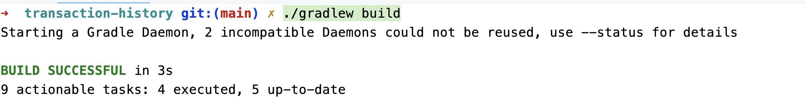
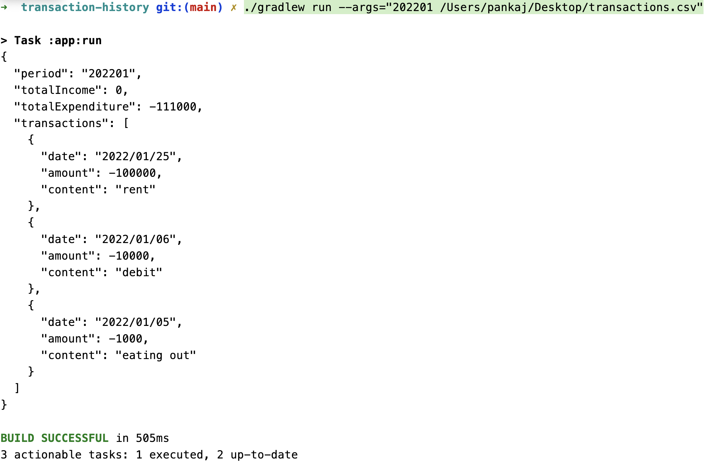
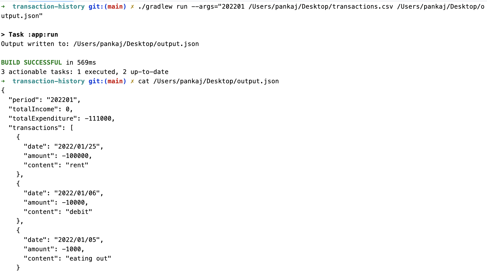
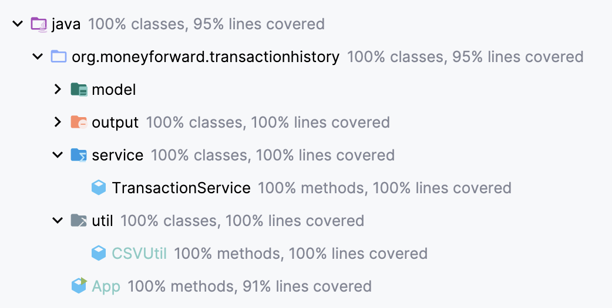

---

# Financial Transaction History

## Overview

The Financial Transaction History application is a command-line tool designed for personal use to generate a history of all deposits and withdrawals for a specified month. The program reads a CSV file containing transaction records and produces a summary of total income, total expenditure, and a list of transactions for the specified period. The output can be printed to the console or written to a JSON file.

## Features

- Parse transaction data from a CSV file
- Filter transactions by a specified month
- Calculate total income and total expenditure
- Output the results in JSON format to the console or to a file

## Assumptions
1. - Assignment Statement:Create a program designed for personal use that generates a history of all deposits and withdrawals for a specified month
   - Assumption: Since this is the personal use program, multi-threading features takes back-seat and simplicity and readability is more important. So, i tried to keep code as simple and readable as possible.
2. - Assignment Statement: Create a program designed for personal
   - Assumption: since it's a single person usage app, i'm assuming that the person will be the maintainer(thus will have access to the codebase),
 so I have given the gradle commands below instead of the jar commands(which is pretty simple to do so if required as I already added the jar task in gradle DSL)


## Getting Started

### Prerequisites

- Java 8 or higher
- Gradle

### Installation

1. Clone the repository:
   ```sh
   git clone git@github.com:PankajVP/transaction-history.git
   cd transaction-history
   ```

2. Build the project using Gradle:
   ```sh
   ./gradlew build
   ```


### Usage

1. Run the program with the required arguments:
   ```sh
    ./gradlew run --args="<YYYYMM> <CSV_FILE_PATH> [OUTPUT_FILE_PATH]"
   ```
   Example:
   ```sh
    ./gradlew run --args="<YYYYMM> <CSV_FILE_PATH> [OUTPUT_FILE_PATH]"
   ```
    - `<YYYYMM>`: The month for which to generate the transaction history (e.g., `202201` for January 2022).
    - `<CSV_FILE_PATH>`: The path to the CSV file containing transaction data.
    - `[OUTPUT_FILE_PATH]` (optional): The path to the output JSON file. If not provided, the output will be printed to the console.

### Examples

- Output to console:
  ```sh
  ./gradlew run --args="202201 /Users/pankaj/Desktop/transactions.csv"
  ```

- Output to a JSON file:
  ```sh
   ./gradlew run --args="202201 /Users/pankaj/Desktop/transactions.csv /Users/pankaj/Desktop/output.json"
  ```
### Execution Sreenshots
#### Build:


#### Output to console:


#### Output to a JSON file:



## Code Quality

### Code Coverage [95%]



### Run UTs 
Test the project using Gradle:
   ```sh
   ./gradlew test
   ```
   
### Test Case Documentation
[test-suite](app_test_cases.md)


### CSV File Format

The CSV file should have the following format:

```csv
date,amount,description
2022-01-01,1000.00,Salary
2022-01-05,-50.00,Groceries
2022-01-10,200.00,Freelance
2022-01-15,-30.00,Transport
...
```

- `date`: The date of the transaction in `YYYY-MM-DD` format.
- `amount`: The amount of the transaction (positive for income, negative for expenditure).
- `description`: A description of the transaction.

### Output Example

```json
{
  "period": "202201",
  "totalIncome": 1200.00,
  "totalExpenditure": -80.00,
  "transactions": [
    {
      "date": "2022-01-01",
      "amount": 1000.00,
      "description": "Salary"
    },
    {
      "date": "2022-01-05",
      "amount": -50.00,
      "description": "Groceries"
    },
    {
      "date": "2022-01-10",
      "amount": 200.00,
      "description": "Freelance"
    },
    {
      "date": "2022-01-15",
      "amount": -30.00,
      "description": "Transport"
    }
  ]
}
```

## Project Structure

```
.
├── src
│   ├── main
│   │   ├── java
│   │   │   ├── org
│   │   │   │   └── moneyforward
│   │   │   │       ├── transactionhistory
│   │   │   │       │   ├── App.java
│   │   │   │       │   ├── model
│   │   │   │       │   │   ├── MonthlyStatement.java
│   │   │   │       │   │   └── Transaction.java
│   │   │   │       │   ├── output
│   │   │   │       │   │   ├── FileOutputStrategy.java
│   │   │   │       │   │   └── StandardOutputStrategy.java
│   │   │   │       │   ├── service
│   │   │   │       │   │   └── TransactionService.java
│   │   │   │       │   └── util
│   │   │   │       │       └── CSVUtil.java
│   │   │   └── resources
│   │   │       └── transactions.csv
│   └── test
│       ├── java
│       │   └── org
│       │       └── moneyforward
│       │           └── transactionhistory
│       │               ├── AppTest.java
│       │               ├── model
│       │               │   └── TransactionTest.java
│       │               ├── service
│       │               │   └── TransactionServiceTest.java
│       │               └── util
│       │                   └── CSVUtilTest.java
│       └── resources
│           └── test-transactions.csv
├── build.gradle
└── README.md
```

## License

This project is licensed under the MIT License.

---